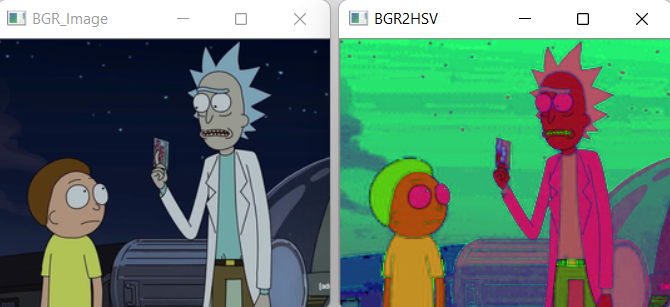
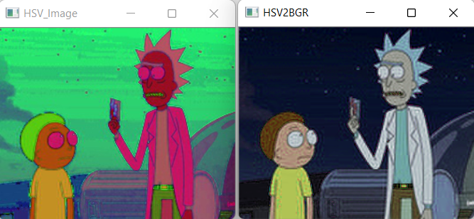
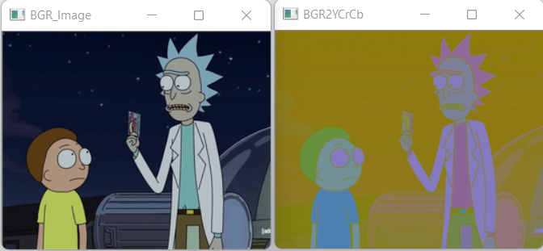
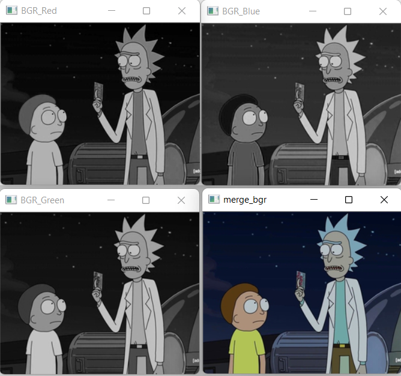
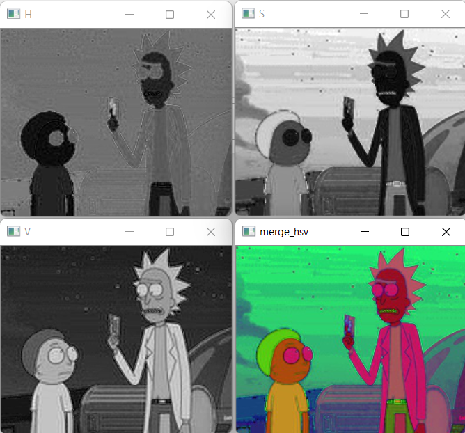

# Color Conversion
## AIM
To perform the color conversion between RGB, BGR, HSV, and YCbCr color models.

## Software Required:
Anaconda - Python 3.7
## Algorithm:
### Step1:
Read the image using cv2.imread()
### Step2:
Convert the BGR image to HSV and HSV to BGR using cv2.cvtColor() and display it using imshow()

### Step3:
Split the BGR image using image[:,:,0] like array or cv2.split()

### Step4:
Merge the image using cv2.merge() and display it using imshow()

### Step5:
Close the window using cv2.waitKey() and cv2.destroyAllWindows()

## Program:
### Developed By: Saravana Kumar.S
### Register Number: 212221230088
### i) Convert BGR and RGB to HSV and GRAY:
```
import cv2
bgr=cv2.imread('rick and morty.jpg')
cv2.imshow('BGR_Image',bgr)
## BGR2HSV
hsv=cv2.cvtColor(bgr,cv2.COLOR_BGR2HSV)
cv2.imshow('BGR2HSV',hsv)
cv2.imwrite('hsv.jpg',hsv)
cv2.waitKey(0)
cv2.destroyAllWindows()
```
## ii)Convert HSV to RGB and BGR
```
import cv2
HSV_image=cv2.imread('hsv.jpg')
cv2.imshow('HSV_Image',HSV_image)
#HSV2BGR
bgr_image=cv2.cvtColor(HSV_image,cv2.COLOR_HSV2BGR)
cv2.imshow('HSV2BGR',bgr_image)
cv2.waitKey(0)
cv2.destroyAllWindows()
```
## iii)Convert RGB and BGR to YCrCb
```
import cv2
BGR_image=cv2.imread('rick and morty.jpg')
cv2.imshow('BGR_Image',BGR_image)
#BGR2YCrCb
YCrCb_image=cv2.cvtColor(BGR_image,cv2.COLOR_BGR2YCrCb)
cv2.imshow('BGR2YCrCb',YCrCb_image)
cv2.waitKey(0)
cv2.destroyAllWindows()
```
## iv)Split and Merge RGB Image
```
import cv2
BGR_image=cv2.imread('rick and morty.jpg')
blue=BGR_image[:,:,0]
green=BGR_image[:,:,1]
red=BGR_image[:,:,2]
cv2.imshow('BGR_Blue',blue)
cv2.imshow('BGR_Green',green)
cv2.imshow('BGR_Red',red)
merge_bgr=cv2.merge((blue,green,red))
cv2.imshow('merge_bgr',merge_bgr)
cv2.waitKey(0)
cv2.destroyAllWindows()
```
## v) Split and merge HSV Image
```
import cv2
image=cv2.imread('rick and morty.jpg')
h, s, v = cv2.split(image)
cv2.imshow('H',h)
cv2.imshow('S',s)
cv2.imshow('V',v)
merge_hsv=cv2.merge((h,s,v))
cv2.imshow('merge_hsv',merge_hsv)
cv2.waitKey(0)
cv2.destroyAllWindows()
```
## Output:
### i) BGR and RGB to HSV and GRAY


### ii) HSV to RGB and BGR


### iii) RGB and BGR to YCrCb


### iv) Split and merge RGB Image


### v) Split and merge HSV Image



## Result:
Thus the color conversion was performed between RGB, HSV and YCbCr color models.
